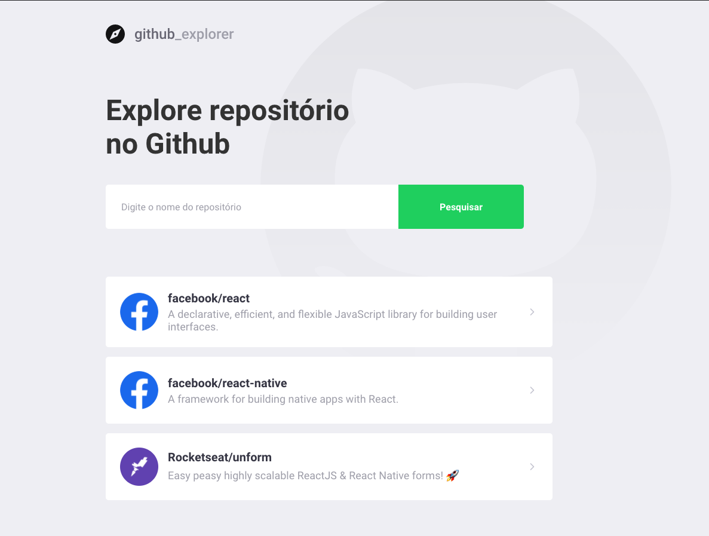

<h1 align="center">
    
</h1>

 

  

# Github Explorer 💻

Github Explorer buscar repositórios consumindo API do Github e lista suas issues.

## 🚀 Tecnologias

Esse projeto foi desenvolvido utilizando as seguintes tecnologias:

- [React](https://reactjs.org)
- [Typescript](https://www.typescriptlang.org/)

## 🚀 Instalação e execução

1. Faça um clone desse repositório;
2. Entre na pasta rodando `cd github-explorer`;
3. Rode `yarn` para instalar as dependências;
4. Rode `yarn start` para iniciar o servidor.

## License

Esse projeto está sob a licença MIT.
